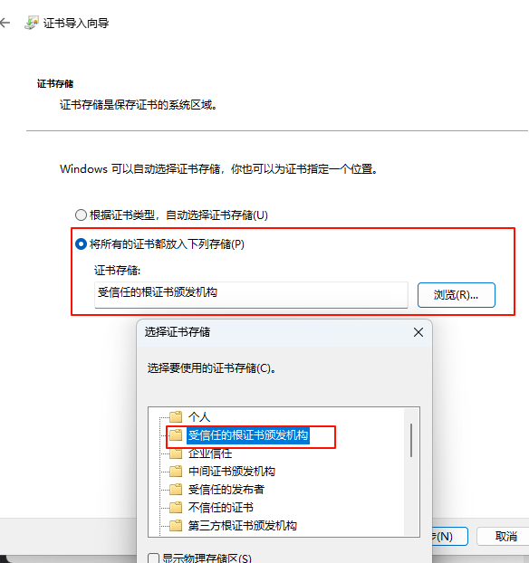
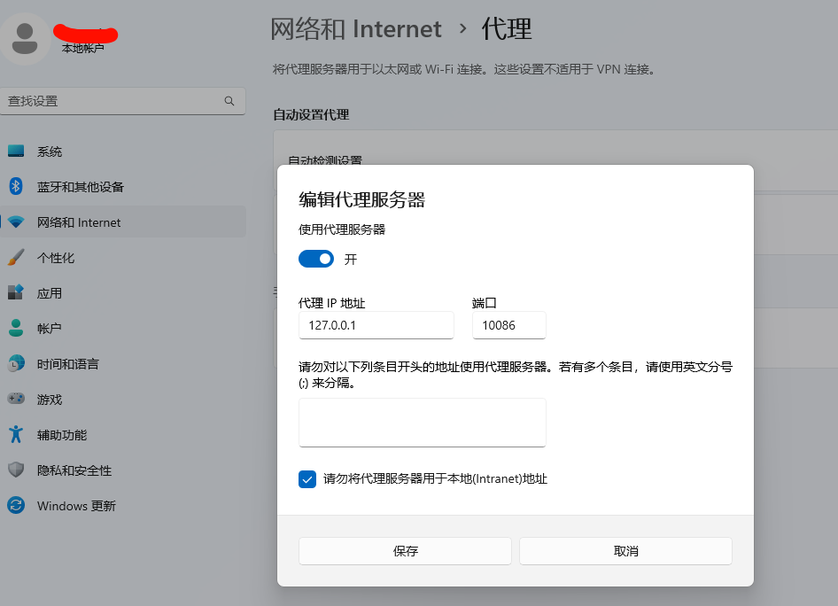

proxypin-go

# 功能列表:
- 网络拦截重定向


# 使用:
1. 安装 cert/server.crt 到 受信任的根证书颁发机构  
   
2. 配置[conf.yml](conf.yml)  
3. 启动程序,查看系统代理是否生效  
   


# 自己生成证书
```shell
#生成私钥
openssl genrsa -out server.key 2048
#根据私钥生成证书申请文件csr
openssl req -new -key server.key -out server.csr
#使用私钥对证书申请进行签名从而生成证书(10年)
openssl x509 -req -in server.csr -out server.crt -signkey server.key -days 3650
```